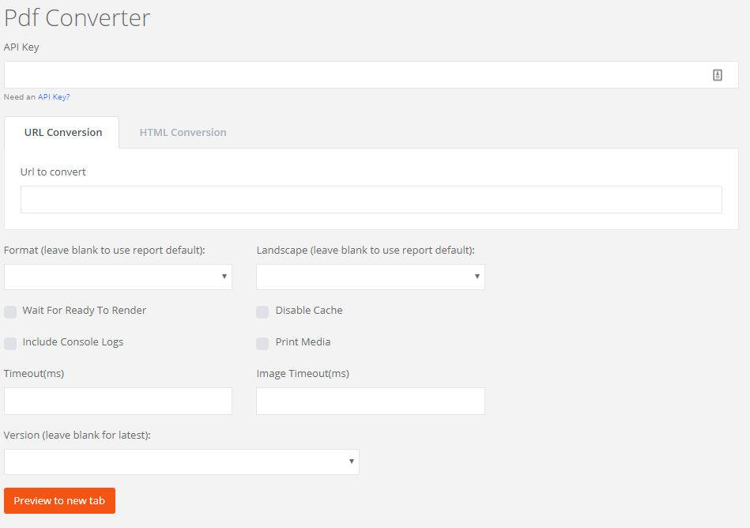

# API and Deployment

## Introduction

The Responsive Paper HTML to PDF API is an easy to use web service that renders web pages annotated with the [Responsive Paper CSS classes](/css-reference) and delivers the paginated view as a PDF document. The service utilizes the headless chrome browser rendering engine incorporating the latest rich html / css / js capabilities.

## Quick Start

Here's a node web server example (be sure to replace the api key with one from your [dashboard](https://www.responsivepaper.com/user/dashboard)):

```
const http = require('http')
const axios = require('axios')

var options = {
  method: "POST",
  url: "https://www.responsivepaper.com/convert",

  data: {
    value: "https://examples.responsivepaper.com/invoice",
    apikey: "__ENTER_YOUR_APIKEY_HERE___",
    waitForReadyToRender: true,
    disableCache: false,
    includeConsole: true,
    format: "Legal",
    landscape: true,
    printMedia: false,
    timeout: 5000
  },
  responseType: 'stream'
};

function streamToString(stream) {
  const chunks = []
  return new Promise((resolve, reject) => {
    stream.on('data', chunk => chunks.push(chunk))
    stream.on('error', reject)
    stream.on('end', () => resolve(Buffer.concat(chunks).toString('utf8')))
  })
}

http.createServer(async function (req, res) {
  if (req.url !== "/") {
    res.writeHead(404)
    res.end()
    return
  }
  try {
    const result = await axios(options)
    result.data.pipe(res)
  } catch (error) {
    const body = await streamToString(error.response.data)
    //TODO parse json
    res.write(body)
    res.end()
  }
}).listen(8080)
```

Please see the deployment folder in the [examples repository](https://github.com/ResponsivePaper/responsivepaper-examples/tree/master/deployment) for more implementation examples.


## Testing UI

You can also test publicly accessible or [tunneled](/getting-started?id=install-tunnel-software) urls, or html, using the [online converter tool](https://www.responsivepaper.com/convert)



## Errors & Console

By default the api will return the raw pdf file, however if an error occurs JSON will be returned.

```
{'error': 'Some error', 'consoleLogs': ['...']}

```

 * `400` - Bad request (parameter validation errors, see error object for more info)
 * `401` - Missing api key
 * `402` - Insufficient account balance
 * `403` - Invalid api key
 * `429` - Too Many Requests (exceeded the plan's concurrency or request limit)
 * `500` - Timeout or javascript rendering error (see error and consoleLogs objects for more info)

The consoleLogs contain messages including:

* Resource requests and if they were loaded from cache
* Timing of the load and rendering
* Any console messages logged by the url
* Error messages generated by the server side rendering engine

If the request is successful the consoleLogs will be displayed on the last page of the pdf if the `includeConsole` parameter was set to `true`.

## Endpoint

### Create and return a PDF document

Invoke a GET or POST request on the following URL:

https://www.responsivepaper.com/api/html2pdf/v2

For GET requests, add the parameters to the query string.

For POST requests, add the parameters to a JSON or url encoded body.

### Parameters

!> IMPORTANT: You must supply either the value and apikey parameters. All referenced sources must be publicly accessible.  All boolean parameters default to false.

?> TIP: If you post html instead of a url for the `value` parameter,  you can set the `base` element in the `head` section so that the Responsive Paper service can resolve relative urls.

```
<base href="https://5c555dec.ngrok.io/">
```

<div class="special_table"></div>

|   []() | |
| -------- | -------------------------------------------- |
| value*<br><small>url/string</small> | The url or html to convert<br><small>**Example:** https://example.com</small><br><small>**Example:** &lt;h1>Test HTML&lt;h1></small> |
| apikey*<br><small>string</small> | Your api key listed on your [dashboard](https://www.responsivepaper.com/user/dashboard) |
| waitForReadyToRender<br><small>bool</small> | Set to `true` if the page needs to perform async operations before the HTML parsing should start. In this case the page should set `window.RESPONSIVE_PAPER_READY_TO_RENDER = true`
| disableCache<br><small>bool</small> | Set to `true` to load all requests over the network |
| includeConsole<br><small>bool</small> | Set to `true` to write console messages to the last page of the pdf, `includeConsole = true` is enforced for free plans |
| format<br><small>string</small> | Set to override the default paper size as set on the rp-page element<br><small>**Example:** Legal [CSS Ref](/css-reference?id=rp-ps-paper-size-and-orientation)</small> |
| landscape<br><small>boolean</small> | Set to 'true' override the default page orientation as set on the rp-page element [CSS Ref](/css-reference?id=rp-ps-paper-size-and-orientation)</small> |
| printMedia<br><small>boolean</small> | If falsy, `emulateMedia: screen` is passed to headless chrome, otherwise `emulateMedia: print` is passed.</small> |
| timeout<br><small>integer</small> | Request will abort if page load and rendering exceed the timeout (ms). Default: 40000, Min: 600, Max: 120000 |
| imageTimeout<br><small>integer</small> | Length of time to wait for images to load (ms). 0: don't wait for images, Default: timeout |
| version<br><small>string</small> | Version of the server side rendering engine, defaults to blank which uses latest engine<br><small>**Example:** 0.1.1</small> |

## Jsreport Integration

[Jsreport.net](https://jsreport.net/) is a fully featured reporting services platform which can do much more than convert html to pdf. It has support for scheduled delivery of documents including excel, word and pdf files. It is very simple to add responsive paper to jsreport using the jsreport-responsivepaper-pdf node package.

```
npm install jsreport-responsivepaper-pdf
```

More information is available at the [jsreport-responsivepaper-pdf](https://github.com/ResponsivePaper/jsreport-responsivepaper-pdf) github repository.
