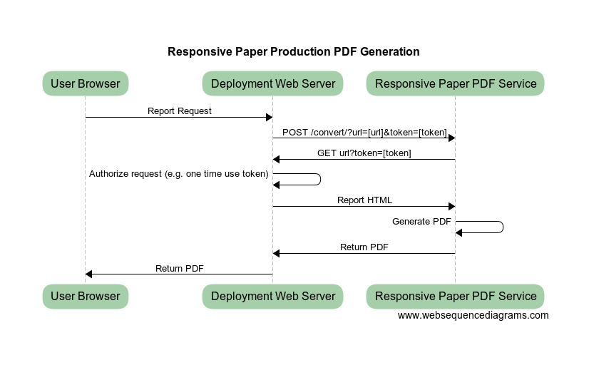
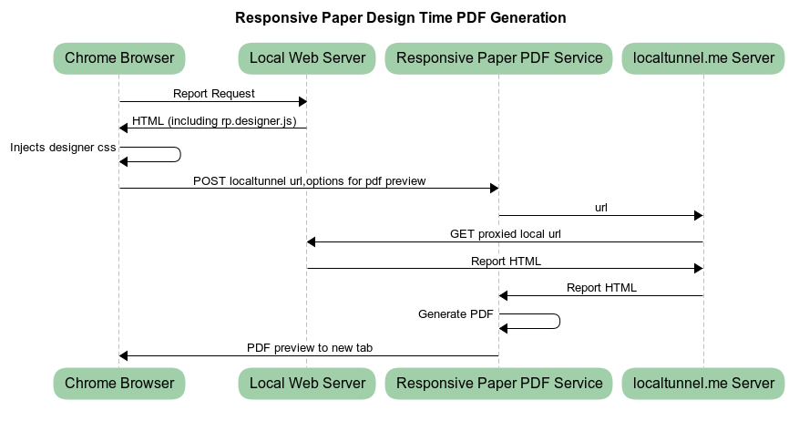

# Getting Started

Building reports using Responsive Paper is simple and intuitive. Responsive Paper is an online service which converts
html or urls and returns a pdf file. In order for you to tap into the power of the Responsive Paper rendering engine, you'll need to annotate your html with the [Responsive Paper CSS classes](/css-reference?id=responsive-paper-css-reference). You can include the [responsive-paper.designer.js](https://responsivepaper.com/devtools/responsive-paper.designer.js) and [responsive-paper.settings.js](https://examples.responsivepaper.com/responsive-paper.settings-template.js) files for a rich design time experience including WYSIWYG page layout and real time pdf previewing.

## Production and Design Time Process Flow

Here is a visualization of the rendering in a production environment:



Here is a visualization of the rendering in a development environment:



## Create a log in and generate a free developer API key

An API key is required to do html to pdf conversion while you are developing locally.  To get an API key, goto the [sign up](https://responsivepaper.com/user/register) page and enter your name, email and password and you will be redirected to your [dashboard](https://responsivepaper.com/user/dashboard) where you can view your API key


## Development Environment

The Responsive Paper Service (RPS) uses headless Chrome server side so for compatibility reasons it is best to develop your reports using [Google Chrome](https://www.google.com/chrome/) or the [Brave browser](https://brave.com/).  For tooling you'll need [git](https://git-scm.com/downloads), [node.js](https://nodejs.org/en/) and an editor such as [VS Code](https://code.visualstudio.com/)


## Install Tunnel Software

Your HTML reports are converted to PDF's using the responsivepaper.com service. In order to test the HTML conversion while you are developing locally you can open a tunnel to your local development server using  [ngrok](https://ngrok.com/download). Once installed start up the tunnel using a command such as:

```
ngrok http -host-header=rewrite https://localhost:44300
```


An alternative is to use the [localtunnel.me](https://github.com/localtunnel/localtunnel) service:

```
npm install -g localtunnel
```

?> TIP: At the time of this writing, localtunnel v2.0.0 had limited support for accessing local web servers over https.  If you need to access your local testing server over https you should stick with the fully featured [ngrok](https://ngrok.com/download) (fremium).

## Install a Local Web Server

If you don't have a local web server installed, install one using:

```
npm install -g live-server
--or
npm install -g http-server
```

### Next Steps

Learn more by cloning the [examples github repository](https://github.com/ResponsivePaper/responsivepaper-examples) and stepping through the [tutorial](/tutorial).

